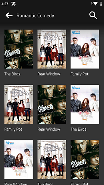

# MockList-30DaysOfKotlin
Android Mock Listing App
========================
A Mock image paginated listing app illustrating Android development with Android Jetpack.

The App illustrate search and pagination of listing data from [3 JSON files](app/src/main/assets)

Signed Build
 ------------
 You can find the signed build from firebase app distribution
 [Download build](https://appdistribution.firebase.dev/i/102fbefa21399246)

Screenshots
-----------

Libraries Used
--------------
* [Foundation][0] - Components for core system capabilities, Kotlin extensions and support for
  multidex and automated testing.
  * [AppCompat][1] - Degrade gracefully on older versions of Android.
  * [Android KTX][2] - Write more concise, idiomatic Kotlin code.
* [Architecture][10] - A collection of libraries that help you design robust, testable, and
  maintainable apps. Start with classes for managing your UI component lifecycle and handling data
  persistence.
  * [Data Binding][11] - Declaratively bind observable data to UI elements.
  * [Lifecycles][12] - Create a UI that automatically responds to lifecycle events.
  * [LiveData][13] - Build data objects that notify views when the underlying database changes.
  * [Navigation][14] - Handle everything needed for in-app navigation.
  * [Paging library][16] -  Loading partial data on demand reduces usage of network bandwidth and system resources.
  * [ViewModel][17] - Store UI-related data that isn't destroyed on app rotations. Easily schedule
     asynchronous tasks for optimal execution.
* [UI][30] - Details on why and how to use UI Components in your apps - together or separate
  * [Animations & Transitions][31] - Move widgets and transition between screens.
  * [Fragment][34] - A basic unit of composable UI.
  * [Layout][35] - Layout widgets using different algorithms.
* Third party
  * [Coil][90] for image loading
  * [Kotlin Coroutines][91] for managing background threads with simplified code and reducing needs for callbacks
  * [Koin][92] A pragmatic lightweight dependency injection framework for Kotlin developers.
  
  [0]: https://developer.android.com/jetpack/components
  [1]: https://developer.android.com/topic/libraries/support-library/packages#v7-appcompat
  [2]: https://developer.android.com/kotlin/ktx
  [10]: https://developer.android.com/jetpack/arch/
  [11]: https://developer.android.com/topic/libraries/data-binding/
  [12]: https://developer.android.com/topic/libraries/architecture/lifecycle
  [13]: https://developer.android.com/topic/libraries/architecture/livedata
  [14]: https://developer.android.com/topic/libraries/architecture/navigation/
  [16]: https://developer.android.com/topic/libraries/architecture/paging
  [17]: https://developer.android.com/topic/libraries/architecture/viewmodel
  [18]: https://developer.android.com/topic/libraries/architecture/workmanager
  [30]: https://developer.android.com/guide/topics/ui
  [31]: https://developer.android.com/training/animation/
  [34]: https://developer.android.com/guide/components/fragments
  [35]: https://developer.android.com/guide/topics/ui/declaring-layout
  [90]: https://github.com/coil-kt/coil
  [91]: https://kotlinlang.org/docs/reference/coroutines-overview.html
  [92]: https://github.com/InsertKoinIO/koin

 

License
-------
Copyright (c) Rimon Solutions.Private Limited
Permission is hereby granted, free of charge, to any person obtaining a copy of this software and associated documentation files (the "Software"), to deal in the Software without restriction, including without limitation the rights to use, copy, modify, merge, publish, distribute, sublicense, and/or sell copies of the Software, and to permit persons to whom the Software is furnished to do so, subject to the following conditions:
The above copyright notice and this permission notice shall be included in all copies or substantial portions of the Software.
THE SOFTWARE IS PROVIDED "AS IS", WITHOUT WARRANTY OF ANY KIND, EXPRESS OR IMPLIED, INCLUDING BUT NOT LIMITED TO THE WARRANTIES OF MERCHANTABILITY, FITNESS FOR A PARTICULAR PURPOSE AND NONINFRINGEMENT. IN NO EVENT SHALL THE AUTHORS OR COPYRIGHT HOLDERS BE LIABLE FOR ANY CLAIM, DAMAGES OR OTHER LIABILITY, WHETHER IN AN ACTION OF CONTRACT, TORT OR OTHERWISE, ARISING FROM, OUT OF OR IN CONNECTION WITH THE SOFTWARE OR THE USE OR OTHER DEALINGS IN THE SOFTWARE.

